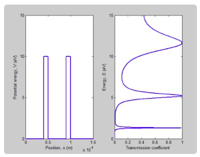
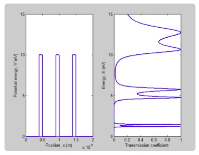
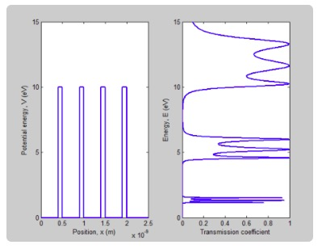
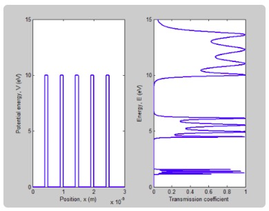
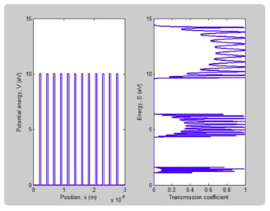
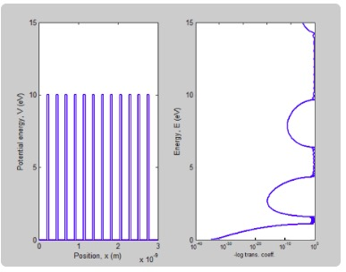

## 양자역학에 대한 시간 독립 Shrödinger 방정식의 해

시간 독립 Shrödinger 방정식은 다음과 같습니다.

$$
-\frac{\hbar^{2}}{2 m} \frac{\partial^{2} \psi}{\partial x^{2}}+U(x) \psi=0
$$

### 1차원 포텐셜 우물에서의 파동함수와 에너지 준위

2중 포텐셜 우물일 경우

<iframe src='https://gfycat.com/ifr/insidiousbiggrizzlybear' frameborder='0' scrolling='no' width='100%' height='100%' style='position:absolute;top:0;left:0;' allowfullscreen></iframe>

3중 포텐셜 우물일 경우

<iframe src='https://gfycat.com/ifr/falsepleasingkomododragon' frameborder='0' scrolling='no' width='100%' height='100%' style='position:absolute;top:0;left:0;' allowfullscreen></iframe>

4중 포텐셜 우물일 경우

<iframe src='https://gfycat.com/ifr/friendlydisloyalhornbill' frameborder='0' scrolling='no' width='100%' height='100%' style='position:absolute;top:0;left:0;' allowfullscreen></iframe>

[1D finite single potential well 에서의 bound state 계산 SW](https://www.edison.re.kr/scienceappstore/-/scienceapp/1DBoundStateLAB/1-0-0/view)을 활용해 직접 시뮬레이션을 해볼 수 있습니다.

### 1차원 포텐셜 우물에서의 계산된 투과율

장벽이 2개일 경우

장벽이 3개일 경우

장벽이 4개일 경우

장벽이 5개일 경우

장벽이 12개일 경우(1)

장벽이 12개일 경우(2)

##  양자역학에 대한 시간 의존 Shrödinger 방정식의 해

시간 의존 Shrödinger 방정식 다음과 같습니다.

$$
i \hbar \frac{\partial \psi}{\partial t}=-\frac{\hbar^{2}}{2 m} \frac{\partial^{2} \psi}{\partial x^{2}}+U(x) \psi
$$

#### 1차원 포텐셜 우물에서의 계산된 투과율

1차원 4각 포텐셜 장벽(낮은 장벽)

<iframe src='https://gfycat.com/ifr/deepdesertedbasenji' frameborder='0' scrolling='no' width='100%' height='100%' style='position:absolute;top:0;left:0;' allowfullscreen></iframe>

1차원 3각 포텐셜 장벽

<iframe src='https://gfycat.com/ifr/mealyminiatureflatfish' frameborder='0' scrolling='no' width='100%' height='100%' style='position:absolute;top:0;left:0;' allowfullscreen></iframe>

1차원 4각 포텐셜 장벽(높은 장벽)

<iframe src='https://gfycat.com/ifr/ShinyLikableAustraliankelpie' frameborder='0' scrolling='no' width='100%' height='100%' style='position:absolute;top:0;left:0;' allowfullscreen></iframe>

1차원 조화 포텐셜(낮은 에너지 준위 11개 조합)

<iframe src='https://gfycat.com/ifr/SharpCircularIndianrhinoceros' frameborder='0' scrolling='no' width='100%' height='100%' style='position:absolute;top:0;left:0;' allowfullscreen></iframe>

[Gaussian Wave Packet Tunneling : wave packet에 대한 슈레딩거 방정식의 해](https://www.edison.re.kr/scienceappstore/-/scienceapp/TunnelingGWPLAB/1-2-0/view)을 활용해 직접 시뮬레이션을 해볼 수 있습니다.

#### 시간 의존 Shrödinger 방정식의 해

2차원 가우션 웨이브패킷과 포텐셜 장벽의 상호작용

<iframe src='https://gfycat.com/ifr/BoilingTerrificArizonaalligatorlizard' frameborder='0' scrolling='no' width='100%' height='100%' style='position:absolute;top:0;left:0;' allowfullscreen></iframe>

<iframe src='https://gfycat.com/ifr/SpiffyTornAllosaurus' frameborder='0' scrolling='no' width='100%' height='100%' style='position:absolute;top:0;left:0;' allowfullscreen></iframe>

[2차원 가우시안 웨이브 패킷](https://www.edison.re.kr/scienceappstore/-/scienceapp/gwp2d/1-0-0/view)을 활용해 직접 시뮬레이션을 해볼 수 있습니다.

